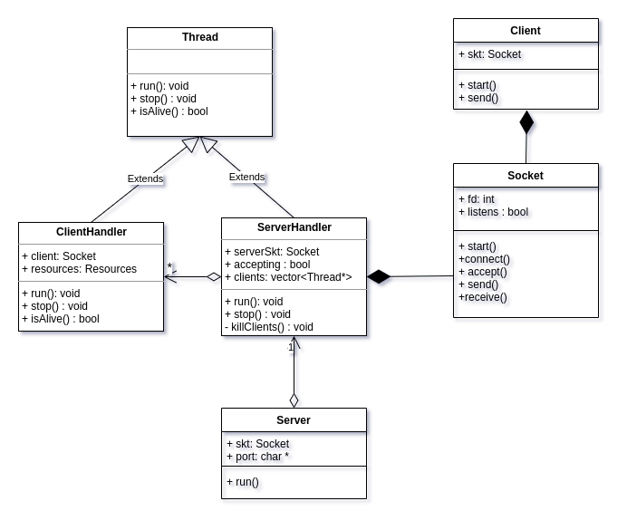

### Nombre : López Núñez, Agustín 
### Padrón: 101826 
### Repositorio : https://github.com/agustinlopezn/tp3-taller-de-programacion
 
<h1>

Taller de Programacion I [75.42] - TP3: Taller pages

</h1>

# Diseño general

# Server
Para el desarrollo de este tp fue requerido crear un server capaz de manejar múltiples clientes a la vez mediante la utilización de hilos. Para esto se usó una clase capaz de aceptar clientes nuevos, procesar sus *requests* y matar los clientes ya procesados. Para detener el proceso del servidor se puso como condición el ingreso del caractér 'q'. 
La clase *ServerHandler* es un hilo encargado de manejar a la cola de clientes y cada vez que recibe una conexión entrante, la acepta y lanza un hilo (que es una clase llama *ClientHandler*) el cual se encarga de recibir el mensaje, procesarlo y enviar la respuesta pertinente, obtenida de un recurso compartido *Resources*, el cual fue protegido con un mutex (implementado con un *Lock* para aplicar RAII) para evitar *Race conditions*. 
*Protocol parser* es el encargado del parseo de las lineas entrantes, utilizando un *stream* para facilitar la tarea.

# Client
Por el lado del cliente el flujo es mucho más sencillo. Como el cliente solo envía un mensaje y luego recibe la respuesta no se encontró gran necesidad de encapsular comportamiento en otras clases, únicamente se encapsuló la lectura de entrada estandar en la clase *reader*. 

# Mejoras pendientes
Debido a un bug causado por copiar los mensajes de respuesta del servidor del PDF se perdió mucho tiempo intentando encontrarlo sin exito, a causa de esto no se pudo hacer ciertas mejoras requeridas que se enumeran a continuación:
 * Refactor de los mensajes de respuesta del servidor. La idea es hacer una clase Response que tenga un método *virtual* que implementen las clases responseGet, responsePost, etc; aplicando polimorfismo.
 * Hacer el socket RAII agregando el close dentro del destructor pero evitando doble closes.
 * Limpieza del repositorio.